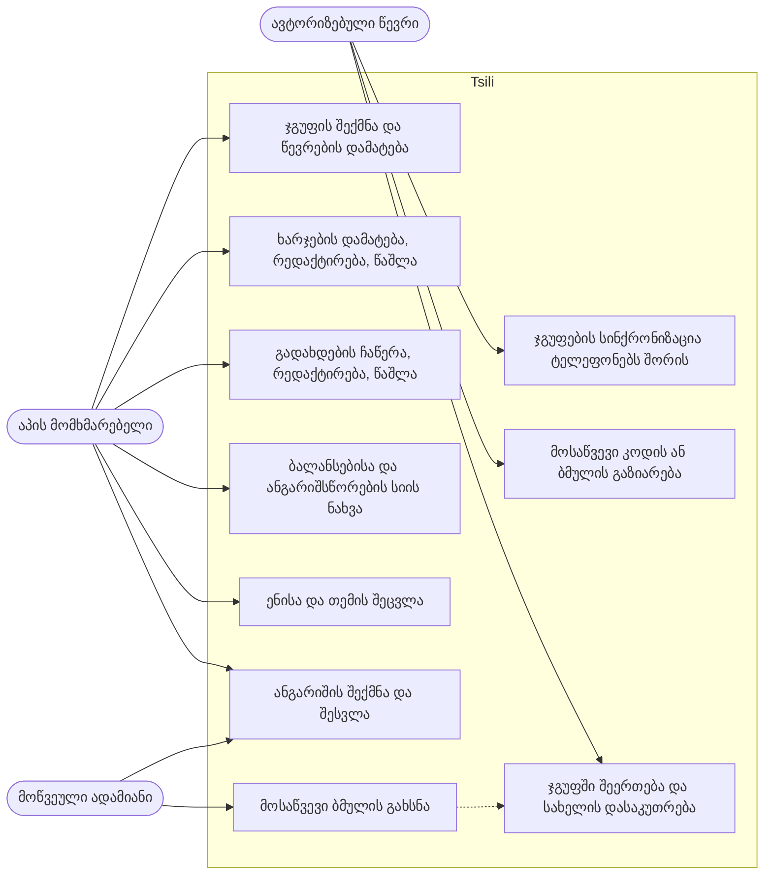
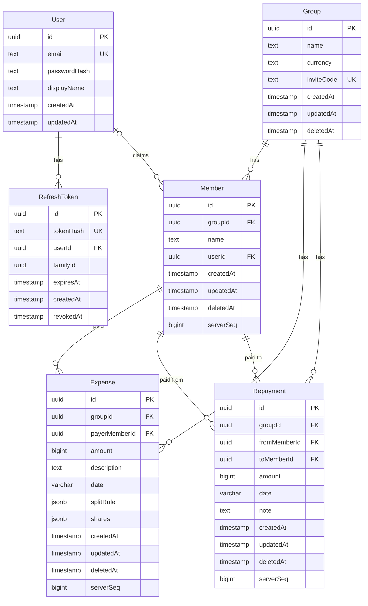

<h1 align="center">Tsili</h1>

<p align="center">
  მობილური აპლიკაცია, რომელიც მოგზაურობის ან ბინის საერთო ხარჯებს ყოფს, მუშაობს ინტერნეტის გარეშე და ტელეფონებს შორის სინქრონიზდება.
</p>

<p align="center">
  
  
  
  
  
  
  
  
  <a href="LICENSE"></a>
  <a href="https://github.com/MrTabaOfficial/Tsili-Project/actions/workflows/ci.yml"></a>
</p>

<p align="center"><a href="README.md">English</a> · ქართული</p>

<p align="center">
  
</p>

## პროექტის შესახებ

Tsili (წილი) მეგობრებისთვისაა, რომლებიც ერთად მოგზაურობენ, და ბინის მეზობლებისთვის, რომლებიც ერთმანეთის მაგივრად იხდიან. თითოეული იწერს, რა გადაიხადა და ვისთვის. აპი თითოეული ადამიანის ბალანსს ითვლის და გთავაზობს გადახდების მოკლე სიას, რომლის შემდეგაც ყველას ბალანსი ნულდება. ყველაფერი ტელეფონზე, კავშირის გარეშე მუშაობს. როცა წევრი ანგარიშში შედის, მისი ჯგუფები პატარა API-ის მეშვეობით სხვა წევრების ტელეფონებთან სინქრონიზდება.

ეს პროექტი პორტფოლიოსთვის ავაწყვე, რომ მევარჯიშა იმ ნაწილებში, რომლებშიც ასეთ აპლიკაციაში შეცდომის დაშვება ადვილია. ფული მთელ თეთრებად ინახება და დეტერმინირებული წესით იყოფა, ამიტომ ყველა ტელეფონი და სერვერი ერთსა და იმავე რიცხვებს იღებს. ტელეფონს საკუთარი SQLite ბაზა აქვს და ცვლილებებს მოგვიანებით აგზავნის; კონფლიქტის დროს უფრო ახალი ცვლილება იმარჯვებს. ავტორიზაცია ხანმოკლე access token-ებსა და ყოველ გამოყენებაზე ცვლად refresh token-ებს იყენებს. აპი ქართულადაც არის ნათარგმნი, იმ ბრუნვის ნიშნებიანად, რომლებსაც სახელები წინადადებაში იღებს.

> **შენიშვნა.** ეს პორტფოლიოს პროექტია. სადმე განთავსებული სერვერი არ არსებობს და აპი არც მაღაზიებშია; სერვერსაც და აპსაც თავად უშვებ. სქრინშოტებზე ნაჩვენები ადამიანები და თანხები სანიმუშო მონაცემებია.

## სარჩევი

- [შესაძლებლობები](#შესაძლებლობები)
- [სქრინშოტები](#სქრინშოტები)
- [Use case დიაგრამა](#use-case-დიაგრამა)
- [მონაცემთა ბაზა](#მონაცემთა-ბაზა)
- [ტექნოლოგიები](#ტექნოლოგიები)
- [პროექტის სტრუქტურა](#პროექტის-სტრუქტურა)
- [გაშვება](#გაშვება)
- [Route-ები და API](#route-ები-და-api)
- [უსაფრთხოება](#უსაფრთხოება)
- [გამოყენებული პროექტები](#გამოყენებული-პროექტები)
- [ლიცენზია](#ლიცენზია)

## შესაძლებლობები

**ჯგუფები და წევრები**

- შექმენი ჯგუფი მოგზაურობისთვის ან ბინისთვის და დაამატე ადამიანები სახელით, სანამ რომელიმე მათგანს აპი ექნება.
- გადაარქვი ჯგუფს სახელი, ამოშალე წევრი, რომელიც ჯერ არ შემოერთებულა, ან წაშალე ჯგუფი.
- გააზიარე რვასიმბოლოიანი მოსაწვევი კოდი ან ბმული, რომელიც აპს შეერთების ეკრანზე უკვე შევსებული კოდით ხსნის.
- შეუერთდი სხვის ჯგუფს კოდით და აირჩიე, ჩამოთვლილი სახელებიდან რომელი ხარ შენ, ან შეუერთდი ახალი სახელით.

**ხარჯები და გადახდები**

- დაამატე ხარჯი: აღწერა, თანხა, თარიღი და ვინ გადაიხადა.
- გაყავი თანაბრად არჩეულ ადამიანებზე, ზუსტი თანხებით ან წილებით (ერთი ითვლება 2-ად, მეორე 1-ად).
- შენახვამდე ნახე, ვის რამდენი ერგება.
- გახსენი ხარჯი, ნახე მისი განაწილება, შემდეგ დაარედაქტირე ან წაშალე.
- ჩაწერე გადახდა ერთი წევრიდან მეორეზე, სურვილისამებრ შენიშვნით, და მოგვიანებით დაარედაქტირე ან წაშალე.

**ბალანსები და ანგარიშსწორება**

- ჯგუფის თავში ჩანს, გმართებს თუ გერგება, და ჯგუფის ჯამური დანახარჯი.
- ნახე ყველა წევრის ბალანსი; ის ყოველ ჯერზე ჩანაწერებიდან თავიდან ითვლება.
- ნახე ანგარიშსწორების სია, ვინ ვის უნდა გადაუხადოს, და ერთი შეხებით ჩაწერე რომელიმე გადახდა.
- ჯგუფების სიაში თითოეულ ბარათზე ჩანს შენი ბალანსი.

**ანგარიში და სინქრონიზაცია**

- ყველა ეკრანი ანგარიშისა და კავშირის გარეშე მუშაობს; მონაცემები ტელეფონზე ინახება.
- შექმენი ანგარიში ან შედი, რომ ჯგუფები სხვა ტელეფონებთან დასინქრონდეს.
- სინქრონიზაცია ეშვება ყოველი ცვლილების შემდეგ, აპში დაბრუნებისას და მოთხოვნით.
- ნახე, როდის იყო ბოლო სინქრონიზაცია, რამდენი ცვლილება ელოდება და რომელი ჩანაწერი უარყო სერვერმა.
- ჯგუფი სხვა ტელეფონზე მოსაწვევი კოდით ხვდება. ახალ ტელეფონზე მხოლოდ შესვლა ჯგუფებს ჯერ არ ჩამოტვირთავს; იქ კოდი ერთხელ უნდა შეიყვანო.

**ენა და გარეგნობა**

- გადართე ქართულსა და ინგლისურს შორის ან მიჰყევი მოწყობილობის ენას.
- გადართე ღია და მუქ თემას შორის ან მიჰყევი მოწყობილობის თემას.
- თანხები და თარიღები არჩეული ენის წესით იწერება. ლარის ნიშანი (₾) ბრაუზერის build-ში ჩანს; Android build ამჟამად „GEL 118.62“-ს წერს.

## სქრინშოტები

გადაღებულია აპის ვებ-ბილდიდან, ტელეფონის ზომის ეკრანზე, სანიმუშო მონაცემებით. ბოლო სურათი ემულატორზე გაშვებული Android development build-ია.

<table>
  <tr>
    <th width="50%">ჯგუფები</th>
    <th width="50%">ხარჯები და გადახდები ჯგუფში</th>
  </tr>
  <tr>
    <td valign="top"></td>
    <td valign="top"></td>
  </tr>
  <tr>
    <th>ხარჯის დამატება, წილებით გაყოფა</th>
    <th>ხარჯის განაწილება</th>
  </tr>
  <tr>
    <td valign="top"></td>
    <td valign="top"></td>
  </tr>
  <tr>
    <th>გადახდის ჩაწერა</th>
    <th>ჯგუფის პარამეტრები და მოსაწვევი კოდი</th>
  </tr>
  <tr>
    <td valign="top"></td>
    <td valign="top"></td>
  </tr>
  <tr>
    <th>ახალი ჯგუფი</th>
    <th>ახალი, ცარიელი ჯგუფი</th>
  </tr>
  <tr>
    <td valign="top"></td>
    <td valign="top"></td>
  </tr>
  <tr>
    <th>კოდით შეერთება</th>
    <th>ანგარიშის შექმნა</th>
  </tr>
  <tr>
    <td valign="top"></td>
    <td valign="top"></td>
  </tr>
  <tr>
    <th>ანგარიში და სინქრონიზაციის სტატუსი</th>
    <th>პარამეტრები</th>
  </tr>
  <tr>
    <td valign="top"></td>
    <td valign="top"></td>
  </tr>
  <tr>
    <th>ქართული ენა, მუქი თემა</th>
    <th>მოსაწვევი ბმული ბრაუზერში</th>
  </tr>
  <tr>
    <td valign="top"></td>
    <td valign="top"></td>
  </tr>
</table>

<p align="center">
  <br>
  <sub>Android development build ემულატორზე: მოსაწვევი ბმულის გახსნის, შესვლისა და სინქრონიზაციის შემდეგ</sub>
</p>

## Use case დიაგრამა



ანგარიშის გარეშე ადამიანს შეუძლია ყველაფერი, რაც მის ტელეფონზე რჩება. შესვლა ამატებს სინქრონიზაციას, მოსაწვევ კოდებსა და ჯგუფში შეერთებას.

## მონაცემთა ბაზა

სერვერი ყველაფერს PostgreSQL-ში ინახავს, Prisma-ს მეშვეობით.



ჯგუფს ჰყავს წევრები და აქვს ხარჯები და გადახდები; ხარჯს ერთი წევრი იხდის, გადახდა კი ერთი წევრიდან მეორეზე მიდის; წევრი შეიძლება მომხმარებლის ანგარიშს უკავშირდებოდეს, მომხმარებელს კი refresh token-ები აქვს. `Member.userId` ცარიელია, სანამ ვინმე შემოუერთდება და ამ სახელს დაისაკუთრებს. თანხები მთელი თეთრებია. სტრიქონები რბილად იშლება `deletedAt`-ით, რომ სხვა ტელეფონებმა წაშლის შესახებ გაიგონ, `serverSeq` კი PostgreSQL-ის ერთი sequence-იდან მოდის და ყველა სინქრონიზებულ ჩანაწერს რიგს ანიჭებს.

ტელეფონი იმავე ოთხ ცხრილს SQLite-ში ინახავს (`groups`, `members`, `expenses`, `repayments`), თითოეულს `dirty` ნიშნით იმ სტრიქონებისთვის, რომლებიც ჯერ არ გაგზავნილა, და დამატებით `sync_state`-ს (სინქრონიზაციის cursor თითო ჯგუფზე) და `settings`-ს (თემა და ენა).

## ტექნოლოგიები

| ფენა | ტექნოლოგია |
| --- | --- |
| ენა | TypeScript 5.9 ყველგან |
| Monorepo | npm workspaces: `shared`, `server`, `app` |
| საზიარო ლოგიკა | zod 4 სქემები; სუფთა ფუნქციები გაყოფისთვის, ბალანსებისა და ანგარიშსწორებისთვის |
| მობილური აპი | Expo SDK 57, React Native 0.86, React 19, Expo Router |
| შენახვა მოწყობილობაზე | SQLite, expo-sqlite-ით; token-ები expo-secure-store-ში |
| სერვერი | Node.js, Express 5, pino ლოგირება, helmet |
| მონაცემთა ბაზა | PostgreSQL 17 (Docker Compose), Prisma 7 pg driver adapter-ით |
| ავტორიზაცია | JWT access token-ები (jose) და ყოველ გამოყენებაზე ცვლადი refresh token-ები; scrypt Node-ის crypto-დან |
| ტესტები | Vitest 5, supertest ნამდვილ PostgreSQL-ზე, Node-ის ჩაშენებული SQLite აპის მონაცემთა ფენისთვის |
| CI | GitHub Actions: typecheck, ყველა ტესტი, Android bundle |

## პროექტის სტრუქტურა

```
Tsili-Project/
├── shared/src/                    კოდი, რომელსაც აპიც და სერვერიც აიმპორტებს
│   ├── money.ts                   თეთრის ტიპი, შეცდომის კოდები, წევრების id-ების მდგრადი რიგი
│   ├── split.ts                   თანაბარი, ზუსტი და წილებით გაყოფა; ზედმეტი თეთრი უდიდესი ნაშთით
│   ├── balances.ts                წევრის წმინდა ბალანსი ხარჯებიდან და გადახდებიდან
│   ├── settle.ts                  ანგარიშსწორების გეგმა: ჯერ ზუსტი დამთხვევები, შემდეგ უდიდესი მოვალე უდიდეს კრედიტორს
│   ├── domain.ts                  zod სქემები: Group, Member, Expense, Repayment
│   ├── api.ts                     request და response სქემები, sync პროტოკოლის ჩათვლით
│   └── format.ts                  თეთრი ტექსტად და უკან, floating point-ის გარეშე
├── server/
│   ├── docker-compose.yml         PostgreSQL 17 და სკრიპტი, რომელიც სატესტო ბაზას ქმნის
│   ├── prisma/schema.prisma       ცხრილები; migration-ები მის გვერდითაა
│   ├── .env.example               ყველა environment ცვლადი, რომელსაც სერვერი კითხულობს
│   ├── test/                      დამხმარეები: ბაზის გასუფთავება, სატესტო მომხმარებლის რეგისტრაცია
│   └── src/
│       ├── index.ts               კითხულობს environment-ს და იწყებს მოსმენას
│       ├── app.ts                 აწყობს Express აპს მისი დამოკიდებულებებიდან
│       ├── env.ts                 ამოწმებს environment-ს გაშვებისას
│       ├── errors.ts              შეცდომის ერთი ფორმა ყველა შემთხვევისთვის
│       ├── rateLimit.ts           მისამართზე მიბმული ლიმიტი ავტორიზაციის route-ებისთვის
│       ├── auth/                  register, login, refresh, logout; პაროლის ჰეშირება; token-ები
│       ├── groups/                ჯგუფები, წევრები, მოსაწვევი კოდები, წევრობის შემოწმება
│       ├── sync/                  push და pull endpoint და მისი კონფლიქტების წესები
│       └── invites/               მოსაწვევი ბმულის ვებ-გვერდი
├── app/
│   ├── app.json, eas.json         Expo-ს კონფიგურაცია და build პროფილები
│   ├── metro.config.js            აძლევს ვებ-ბილდს SQLite-ის wasm ფაილის ჩატვირთვის საშუალებას
│   ├── .env.example               API-ის მისამართი, რომელსაც აპი მიმართავს
│   └── src/
│       ├── app/                   ეკრანები, თითო ფაილი თითო route-ზე
│       ├── db/                    SQLite სქემა და migration-ები, repository-ები, სატესტო adapter
│       ├── domain/                ხარჯის ფორმის ლოგიკა და ჯგუფის უწყისი
│       ├── sync/                  sync engine და provider, რომელიც მას უშვებს
│       ├── auth/                  token-ების შენახვა და ავტორიზაციის მდგომარეობა
│       ├── api/                   fetch-ის გარსი, token-ის განახლების შემდეგ ერთი გამეორებით
│       ├── i18n/                  ინგლისური და ქართული ტექსტები, სახელების ბრუნება
│       ├── settings/              შენახული თემა და ენა
│       ├── ui/                    ღილაკები, სტრიქონები, chip-ები, segmented control, avatar
│       ├── lib/                   id-ები, თარიღები, თანხის ფორმატირება, მოსაწვევი ბმულები
│       └── theme.ts               ფერები, რადიუსები, შრიფტის ზომები
├── docs/screenshots/              ამ README-ის სურათები
└── .github/workflows/ci.yml       typecheck, ტესტები და bundle ყოველ push-ზე
```

ტესტის ფაილები იმ კოდის გვერდითაა, რომელსაც ამოწმებს (`*.test.ts`).

## გაშვება

**რა არის საჭირო**

- Node.js 24 ან უფრო ახალი და npm
- Docker, PostgreSQL-ისთვის. პორტი 5432 თავისუფალი უნდა იყოს.
- აპის Android-ზე გასაშვებად: Android Studio ემულატორით ან მოწყობილობა USB debugging-ით. აპი ბრაუზერშიც ეშვება, ამ ყველაფრის გარეშე.

**ნაბიჯები**

1. დააკლონე რეპოზიტორია.

   ```sh
   git clone https://github.com/MrTabaOfficial/Tsili-Project.git
   cd Tsili-Project
   ```

2. შექმენი სერვერის environment ფაილი და ჩაწერე მასში secret. ეს ინსტალაციამდე გააკეთე: ინსტალაციის დროს Prisma client გენერირდება და `DATABASE_URL`-ს ამ ფაილიდან კითხულობს.

   ```sh
   cp server/.env.example server/.env
   node -e "console.log(require('crypto').randomBytes(48).toString('base64url'))"
   ```

   დაბეჭდილი მნიშვნელობა ჩასვი `server/.env`-ში, `JWT_SECRET`-ად.

3. დააყენე სამივე workspace-ის დამოკიდებულებები.

   ```sh
   npm install
   ```

4. გაუშვი PostgreSQL. პირველი გაშვება `tsili_test` ბაზასაც ქმნის, რომელსაც ტესტები იყენებს.

   ```sh
   npm run db:up -w server
   ```

5. შექმენი ცხრილები.

   ```sh
   npm run db:deploy -w server
   ```

6. გაუშვი API. ის უსმენს მისამართზე http://localhost:4000 და `GET /health` პასუხობს `{"ok":true}`.

   ```sh
   npm run dev -w server
   ```

7. მიუთითე აპს, სად არის API.

   ```sh
   cp app/.env.example app/.env
   ```

   `app/.env`-ში `EXPO_PUBLIC_API_URL` დააყენე: `http://localhost:4000` ბრაუზერისთვის, `http://10.0.2.2:4000` Android ემულატორისთვის, ან `http://<კომპიუტერის ლოკალური მისამართი>:4000` იმავე Wi-Fi-ზე მყოფი ნამდვილი ტელეფონისთვის.

8. გაუშვი აპი, მეორე ტერმინალში.

   ```sh
   npm run web -w app            # ბრაუზერში
   npm run android:dev -w app    # აწყობს და აყენებს Android development build-ს
   ```

   როცა Android build ერთხელ დაყენებულია, შემდეგ გასაშვებად `npm run start -w app` საკმარისია.

**პირველი შესვლა.** წინასწარ შექმნილი მომხმარებლები არ არსებობს. გახსენი ანგარიშის ეკრანი (ადამიანის ხატულა ჯგუფების ეკრანზე), აირჩიე „ანგარიშის შექმნა“ და დარეგისტრირდი ნებისმიერი ელფოსტით და მინიმუმ 8-სიმბოლოიანი პაროლით. აპი ანგარიშის გარეშეც სრულად გამოსაყენებელია.

**ტესტები**

```sh
npm test                      # shared, server და app; server-ის ტესტებს მე-4 ნაბიჯის ბაზა სჭირდება
npm run typecheck
npm run bundle:check -w app   # აწყობს აპის bundle-ს Android-ისთვის, იმპორტისა და კონფიგის შეცდომების დასაჭერად
```

## Route-ები და API

ყველა body JSON-ია. შეცდომებს აქვს ფორმა `{ "error": { "code", "message", "issues?" } }`. „წევრი“ ნიშნავს ავტორიზებულ მომხმარებელს, რომელიც ამ ჯგუფშია; ყველა სხვა იღებს 404-ს.

| Method | Path | წვდომა | დანიშნულება |
| --- | --- | --- | --- |
| GET | `/health` | ღია | სერვერის შემოწმება |
| GET | `/i/:code` | ღია | მოსაწვევი ბმულის HTML გვერდი, ღილაკით, რომელიც აპს ხსნის |
| POST | `/auth/register` | ღია, rate limit-ით | ანგარიშის შექმნა; აბრუნებს მომხმარებელს და token-ების წყვილს |
| POST | `/auth/login` | ღია, rate limit-ით | შესვლა; აბრუნებს მომხმარებელს და token-ების წყვილს |
| POST | `/auth/refresh` | Refresh token, rate limit-ით | refresh token-ის გაცვლა ახალ წყვილზე |
| POST | `/auth/logout` | Refresh token | refresh token-ის გაუქმება |
| GET | `/me` | ავტორიზებული | მიმდინარე მომხმარებელი |
| POST | `/groups` | ავტორიზებული | ჯგუფის შექმნა; შემქმნელი მისი პირველი წევრი ხდება |
| GET | `/groups` | ავტორიზებული | მომხმარებლის ჯგუფები წევრებითურთ |
| GET | `/groups/:groupId` | წევრი | ერთი ჯგუფი წევრებითურთ |
| PATCH | `/groups/:groupId` | წევრი | ჯგუფის სახელის შეცვლა |
| DELETE | `/groups/:groupId` | წევრი | ჯგუფის რბილი წაშლა |
| POST | `/groups/:groupId/members` | წევრი | წევრის დამატება სახელით |
| PATCH | `/groups/:groupId/members/:memberId` | წევრი | წევრის სახელის შეცვლა |
| DELETE | `/groups/:groupId/members/:memberId` | წევრი | წევრის ამოშლა, თუ ის სხვა ანგარიშს არ დაუსაკუთრებია |
| GET | `/invites/:code` | ავტორიზებული | ჯგუფისა და მისი თავისუფალი სახელების ნახვა |
| POST | `/invites/:code/join` | ავტორიზებული | სახელის დასაკუთრება ან ახალი სახელით შეერთება |
| POST | `/groups/:groupId/sync` | წევრი | შეცვლილი წევრების, ხარჯებისა და გადახდების გაგზავნა; cursor-ზე ახალი ყველაფრის მიღება |

ხარჯებსა და გადახდებს საკუთარი route-ები არ აქვს. ისინი ტელეფონზე იქმნება და sync route-ით გადადის.

აპის ეკრანები (Expo Router, ფაილები `app/src/app`-ში):

| Route | ეკრანი |
| --- | --- |
| `/` | ჯგუფების სია |
| `/new-group` | ახალი ჯგუფი |
| `/join` | კოდით შეერთება; `tsili://join?code=…` ბმულიც აქ მოდის |
| `/account` | შესვლა, ანგარიშის შექმნა, სინქრონიზაციის სტატუსი, გასვლა |
| `/settings` | თემა და ენა |
| `/group/[groupId]` | ბალანსები, ანგარიშსწორების სია, ხარჯები და გადახდები |
| `/group/[groupId]/members` | ჯგუფის სახელი, მოსაწვევი კოდი, წევრები, ჯგუფის წაშლა |
| `/group/[groupId]/add-member` | წევრის დამატება |
| `/group/[groupId]/add-expense` | ხარჯის დამატება ან რედაქტირება |
| `/group/[groupId]/add-repayment` | გადახდის ჩაწერა ან რედაქტირება |
| `/group/[groupId]/expense/[expenseId]` | ხარჯის განაწილება |

## უსაფრთხოება

რას აკეთებს კოდი დღეს:

- პაროლები scrypt-ით იჰეშება, თითოეული შემთხვევითი salt-ით, და მუდმივ დროში დარდება.
- login ერთნაირად პასუხობს უცნობ ელფოსტასა და არასწორ პაროლზე და ჰეშს ორივე შემთხვევაში ითვლის.
- access token-ები HS256 JWT-ებია და 15 წუთი მოქმედებს; შემმოწმებელი ალგორითმსაც და issuer-საც აფიქსირებს.
- refresh token-ები 32 შემთხვევითი ბაიტია, მხოლოდ SHA-256 ჰეშად ინახება და ყოველ გამოყენებაზე იცვლება. უკვე გამოყენებულის წარდგენა იმ შესვლის ყველა token-ს აუქმებს.
- register და login შეზღუდულია 20 ცდით ერთ მისამართზე 15 წუთში, refresh კი 60-ით.
- ყველა request body და URL პარამეტრი გამოყენებამდე zod-ით მოწმდება.
- ჯგუფის route-ები წევრობას ამოწმებს და არაწევრს 404-ს უბრუნებს, ამიტომ ჯგუფის id-ების გამოცნობა შეუძლებელია.
- წევრსა და ანგარიშს შორის კავშირს მხოლოდ join route აყენებს; sync route მას უგულებელყოფს.
- სერვერი თითოეული გამოგზავნილი ხარჯის გაყოფას თავიდან ითვლის და უარყოფს მას, თუ შენახული წილები განსხვავდება. ასევე უარყოფს ჩანაწერებს, რომელთა თარიღი ერთ დღეზე მეტით მომავალშია, და ჩანაწერებს, რომლებიც ჯგუფის გარეთ მყოფ ადამიანებს მიუთითებს.
- helmet აყენებს ჩვეულებრივ უსაფრთხოების header-ებს, JSON body 1 MB-ით არის შეზღუდული, ერთი sync request კი თითო ტიპის მაქსიმუმ 1000 ჩანაწერს იტევს.
- სერვერი არ ეშვება, თუ environment არასწორია, მათ შორის როცა `JWT_SECRET` 32 სიმბოლოზე მოკლეა.
- ტელეფონზე token-ები პლატფორმის keystore-ში ინახება, expo-secure-store-ით.
- `.env` ფაილები git-ში არ ხვდება; რეპოში მხოლოდ `.env.example` ფაილებია, placeholder მნიშვნელობებით.

რა უნდა შეიცვალოს, სანამ სადმე საჯაროდ განთავსდება:

- API HTTPS-ით უნდა მუშაობდეს. სანიმუშო კონფიგურაცია ჩვეულებრივ HTTP-ს იყენებს, რომელსაც Android-ისა და iOS-ის release build-ები ნაგულისხმევად ბლოკავს.
- შეცვალე ბაზის პაროლი (compose ფაილში `tsili` წერია) და 5432 პორტი ჰოსტის გარეთ არ გამოაჩინო.
- შეზღუდე CORS. ახლა ნებისმიერი origin დაშვებულია, რაც bearer token-იანი მობილური კლიენტისთვის მისაღებია, ბრაუზერის კლიენტისთვის კი ზედმეტად ღია.
- reverse proxy-ს უკან დააყენე Express-ის `trust proxy`, რომ rate limiter-მა კლიენტების ნამდვილი მისამართები დაინახოს. limiter მთვლელებს მეხსიერებაში ინახავს, ამიტომ რამდენიმე instance-ის შემთხვევაში საერთო საცავიც სჭირდება.
- არ არის ელფოსტის დადასტურება, პაროლის აღდგენა და ანგარიშის წაშლა.
- გამოყენებული და ვადაგასული refresh token-ების სტრიქონები არასდროს იშლება.
- ჯგუფის სახელის შეცვლა და წაშლა ნებისმიერ წევრს შეუძლია; როლები არ არსებობს.
- ბრაუზერის build-ში token-ები `localStorage`-ში ინახება, რადგან expo-secure-store-ს ვებ-იმპლემენტაცია არ აქვს.

## გამოყენებული პროექტები

Tsili ამ open-source პროექტებს იყენებს. მესამე მხარის შაბლონები და სურათები არ გამოყენებულა; სქრინშოტები თავად აპისაა, ხატულები კი Ionicons-იდან არის.

| პროექტი | რისთვის | ლიცენზია |
| --- | --- | --- |
| [Expo](https://expo.dev) და მისი მოდულები (router, sqlite, secure-store, localization, crypto, dev-client, system-ui) | აპის framework და ნატიური API-ები | MIT |
| [React Native](https://reactnative.dev), [React](https://react.dev), [React Native Web](https://necolas.github.io/react-native-web/) | UI runtime | MIT |
| [React Navigation](https://reactnavigation.org), react-native-screens, react-native-safe-area-context | ნავიგაცია | MIT |
| [Ionicons](https://ionic.io/ionicons), @expo/vector-icons-ით | ხატულები | MIT |
| [Express](https://expressjs.com), helmet, cors | HTTP სერვერი | MIT |
| [Prisma](https://www.prisma.io) | ბაზის client და migration-ები | Apache-2.0 |
| [node-postgres](https://node-postgres.com) | PostgreSQL driver | MIT |
| [PostgreSQL](https://www.postgresql.org) | მონაცემთა ბაზა | PostgreSQL License |
| [zod](https://zod.dev) | ვალიდაცია და ტიპები | MIT |
| [jose](https://github.com/panva/jose) | JWT-ის ხელმოწერა და შემოწმება | MIT |
| [pino](https://getpino.io) | ლოგირება | MIT |
| [Vitest](https://vitest.dev), supertest, tsx | ტესტები და TypeScript-ის გაშვება | MIT |
| [TypeScript](https://www.typescriptlang.org) | ენა | Apache-2.0 |

## ლიცენზია

[MIT](LICENSE)
