<h1 align="center">Tsili</h1>

<p align="center">
  A mobile app that splits shared expenses for a trip or a flat, works offline, and syncs between phones.
</p>

<p align="center">
  
  
  
  
  
  
  
  
  <a href="LICENSE"></a>
  <a href="https://github.com/MrTabaOfficial/Tsili-Project/actions/workflows/ci.yml"></a>
</p>

<p align="center">English · <a href="README.ka.md">ქართული</a></p>

<p align="center">
  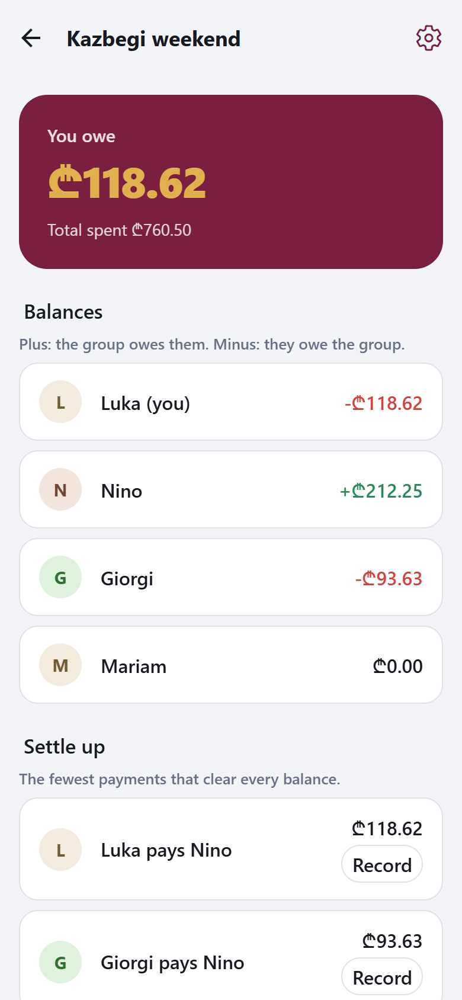
</p>

## About

Tsili (წილი, "share" in Georgian) is for friends on a trip or flatmates who pay for things on each other's behalf. Each person records what they paid and who it was for. The app keeps a balance per person and proposes a short list of payments that brings everyone to zero. Everything works on the phone without a connection. When a member signs in, their groups sync with the other members' phones through a small API.

I built it as a portfolio project to practise the parts of an app like this that are easy to get wrong. Money is stored as whole tetri and split with a deterministic rule, so every phone and the server reach the same numbers. The phone keeps its own SQLite database and pushes changes later, with a newer-edit-wins rule for conflicts. Sign-in uses short-lived access tokens with rotating refresh tokens. The app is translated into Georgian, including the case endings names take inside a sentence.

> **Note.** This is a portfolio project. There is no hosted backend and the app is not in the stores; you run the server and the app yourself. The people and amounts in the screenshots are sample data.

## Contents

- [Features](#features)
- [Screenshots](#screenshots)
- [Use case diagram](#use-case-diagram)
- [Database](#database)
- [Tech stack](#tech-stack)
- [Project structure](#project-structure)
- [Setup](#setup)
- [Routes and API](#routes-and-api)
- [Security](#security)
- [Credits](#credits)
- [License](#license)

## Features

**Groups and members**

- Create a group for a trip or a flat and add the people in it by name, before any of them has the app.
- Rename a group, remove a member who has not joined yet, or delete the group.
- Share an eight-character invite code, or a link that opens the app on the join screen with the code filled in.
- Join someone else's group with the code and pick which of the listed names is you, or join under a new name.

**Expenses and payments**

- Add an expense with a description, an amount, a date and the person who paid.
- Divide it equally among chosen people, by exact amounts, or by shares (one person counts as 2, another as 1).
- See what each person will owe before saving.
- Open an expense to see its breakdown, then edit or delete it.
- Record a payment from one member to another, with an optional note, and edit or delete it later.

**Balances and settling up**

- See at the top of a group whether you owe money or are owed it, and the group's total spending.
- See every member's balance, recomputed from the records each time.
- See a settle-up list of who should pay whom, and record one of those payments with one tap.
- See your balance on each group's card in the groups list.

**Account and sync**

- Use every screen without an account or a connection; the data lives on the phone.
- Create an account or sign in to sync your groups with other phones.
- Sync runs after each change, when the app returns to the foreground, and on demand.
- See when the last sync happened, how many changes are waiting, and any record the server refused.
- A group reaches another phone through its invite code. Signing in on a new phone does not download your groups by itself yet; you enter the code there once.

**Language and appearance**

- Switch between English and Georgian, or follow the device language.
- Switch between light and dark, or follow the device theme.
- Amounts and dates are formatted for the chosen language. The lari sign (₾) shows in the browser build; the Android build currently writes "GEL 118.62".

## Screenshots

Captured from the app's web build at phone size, with sample data. The last image is the Android development build running on an emulator.

<table>
  <tr>
    <th width="50%">Groups</th>
    <th width="50%">Expenses and payments in a group</th>
  </tr>
  <tr>
    <td valign="top">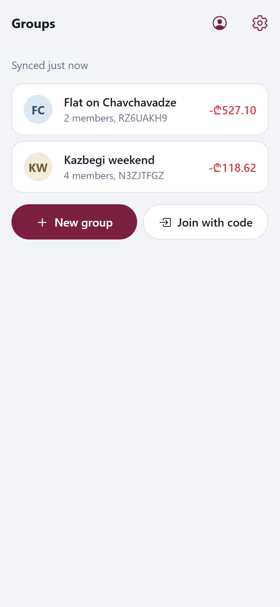</td>
    <td valign="top">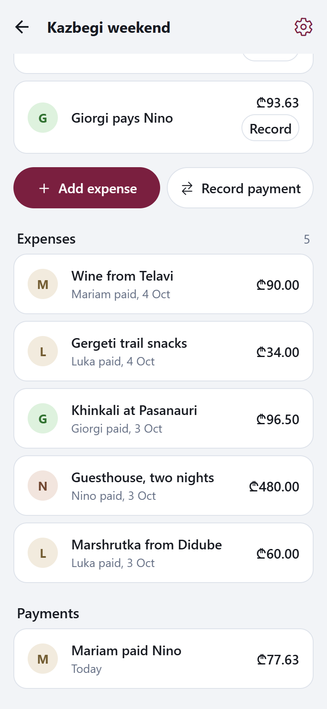</td>
  </tr>
  <tr>
    <th>Add an expense, split by shares</th>
    <th>Expense breakdown</th>
  </tr>
  <tr>
    <td valign="top">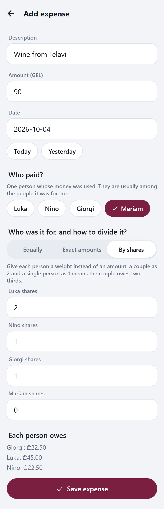</td>
    <td valign="top">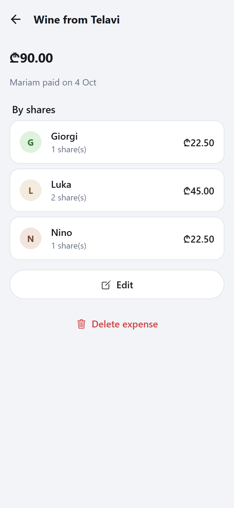</td>
  </tr>
  <tr>
    <th>Record a payment</th>
    <th>Group settings and invite code</th>
  </tr>
  <tr>
    <td valign="top">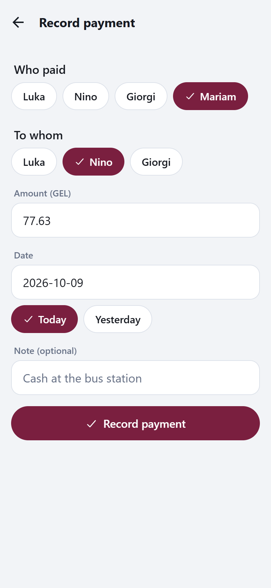</td>
    <td valign="top">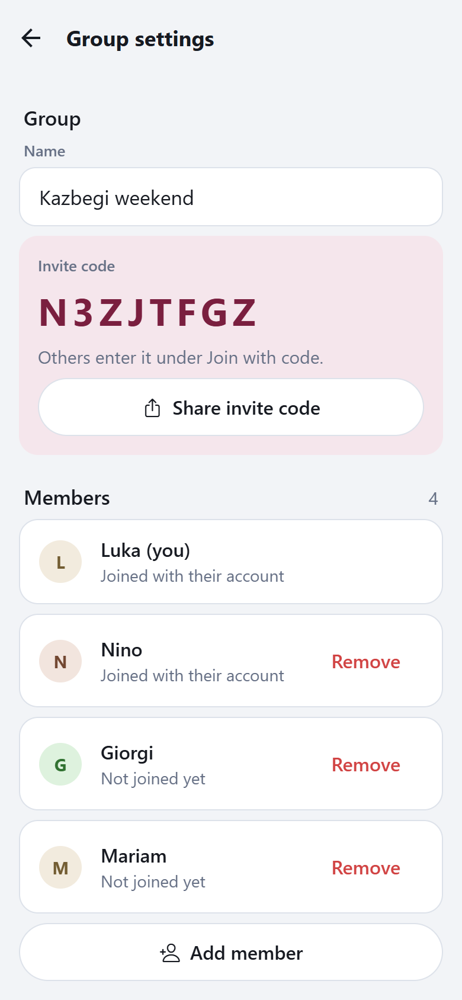</td>
  </tr>
  <tr>
    <th>New group</th>
    <th>A new, empty group</th>
  </tr>
  <tr>
    <td valign="top">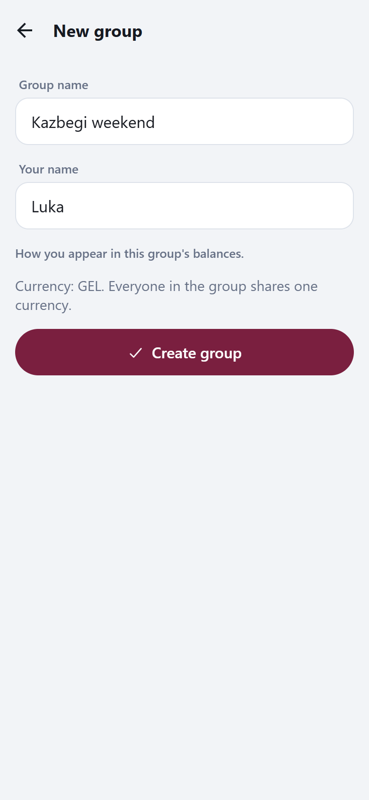</td>
    <td valign="top">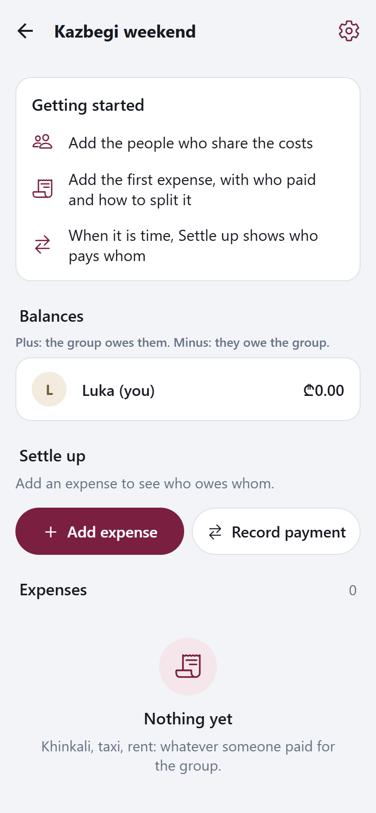</td>
  </tr>
  <tr>
    <th>Join with a code</th>
    <th>Create an account</th>
  </tr>
  <tr>
    <td valign="top">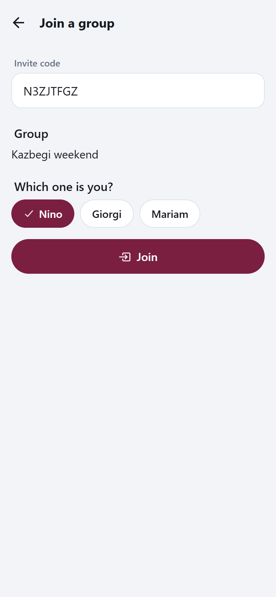</td>
    <td valign="top">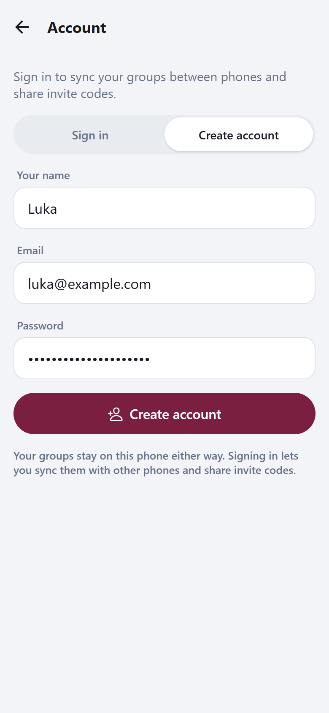</td>
  </tr>
  <tr>
    <th>Account and sync status</th>
    <th>Settings</th>
  </tr>
  <tr>
    <td valign="top">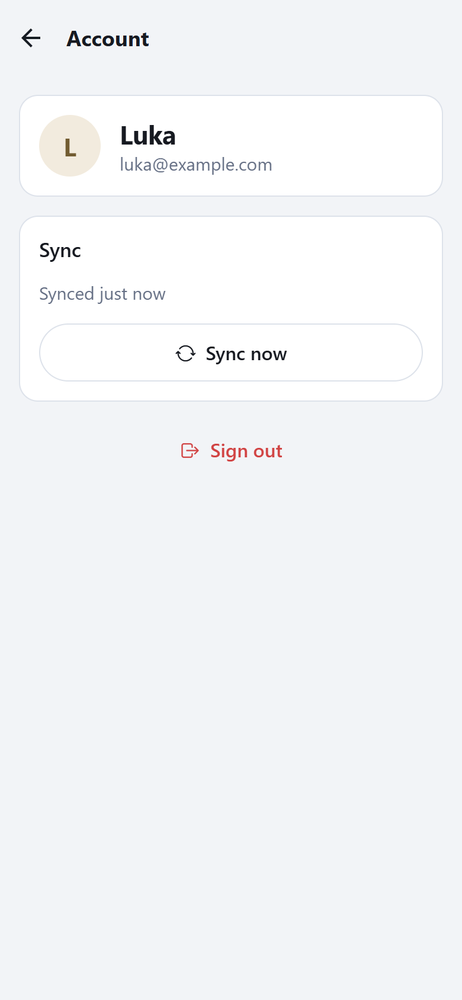</td>
    <td valign="top">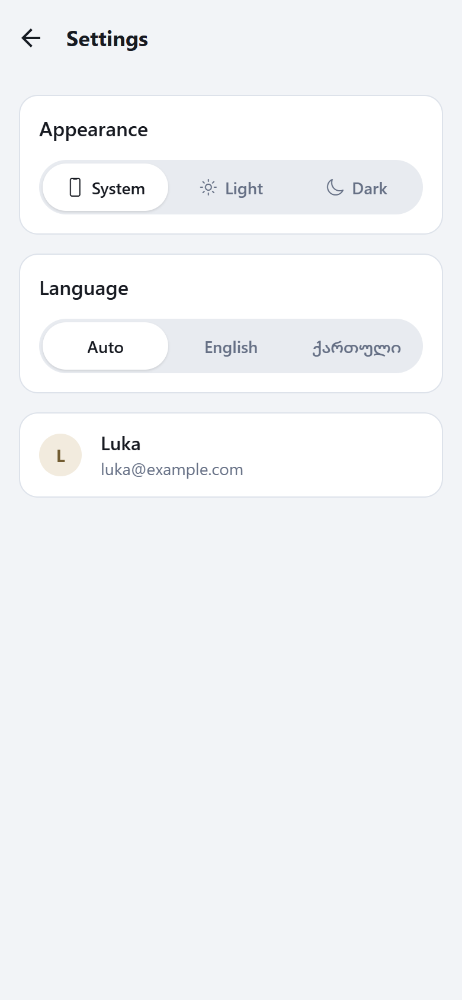</td>
  </tr>
  <tr>
    <th>Georgian, dark theme</th>
    <th>Invite link in a browser</th>
  </tr>
  <tr>
    <td valign="top"></td>
    <td valign="top">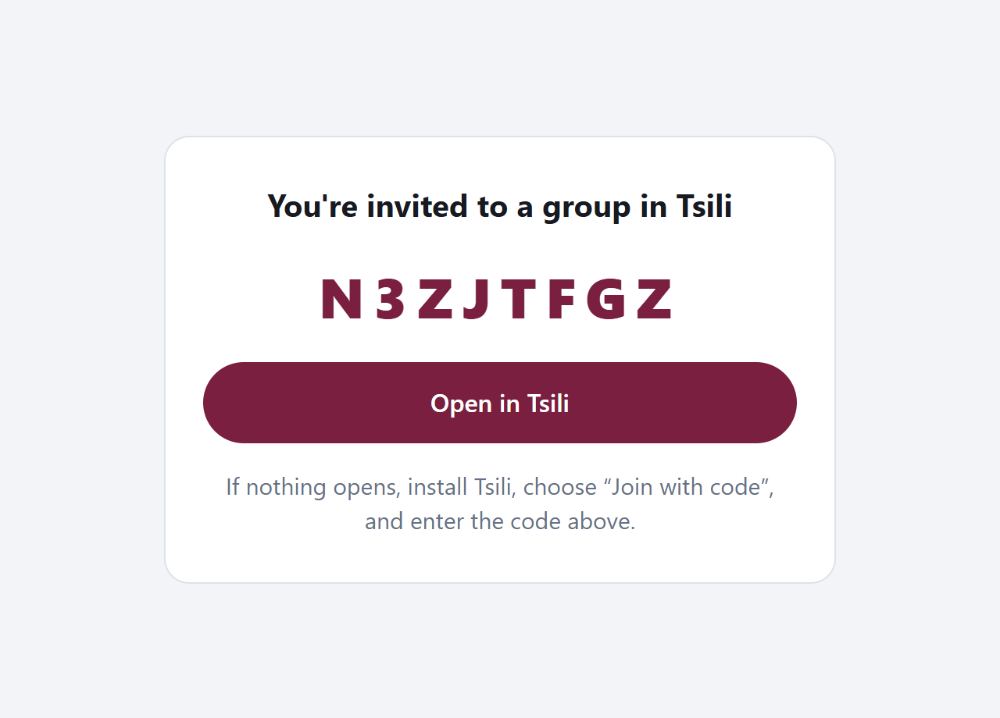</td>
  </tr>
</table>

<p align="center">
  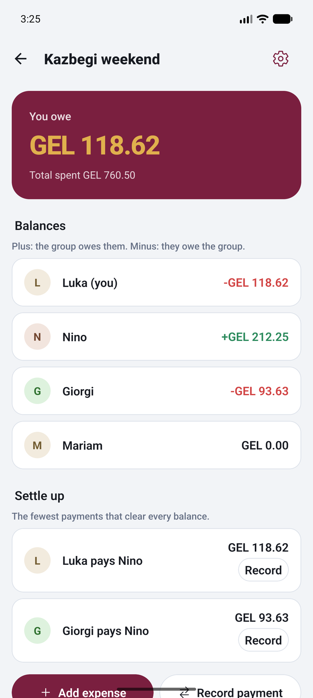<br>
  <sub>Android development build on an emulator, after opening an invite link, signing in and syncing</sub>
</p>

## Use case diagram

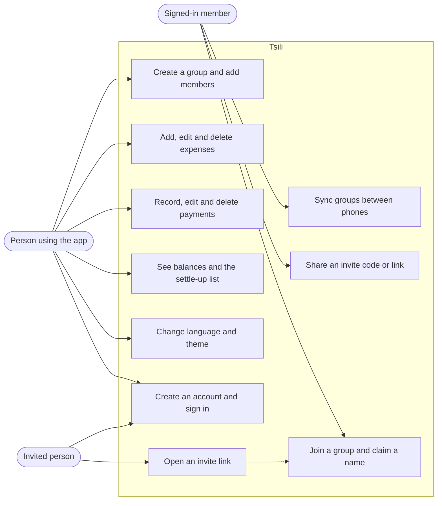

Someone without an account can do everything that stays on their own phone. Signing in adds sync, invite codes and joining.

## Database

The server stores everything in PostgreSQL through Prisma.

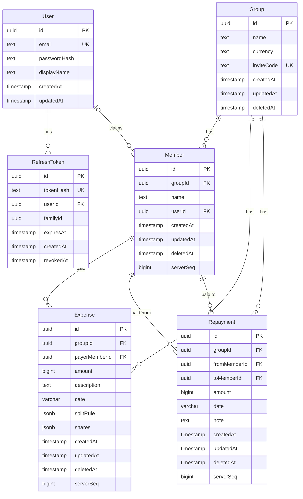

A group has members, expenses and repayments; an expense is paid by one member and a repayment goes from one member to another; a member may be linked to a user account, and a user has refresh tokens. `Member.userId` is empty until someone joins and claims that name. Amounts are whole tetri. Rows are soft-deleted through `deletedAt` so other phones can learn about a deletion, and `serverSeq` comes from one PostgreSQL sequence that gives every synced write an order.

The phone keeps the same four group tables in SQLite (`groups`, `members`, `expenses`, `repayments`), each with a `dirty` flag for rows not pushed yet, plus `sync_state` (the sync cursor per group) and `settings` (theme and language).

## Tech stack

| Layer | Technology |
| --- | --- |
| Language | TypeScript 5.9 everywhere |
| Monorepo | npm workspaces: `shared`, `server`, `app` |
| Shared logic | zod 4 schemas; pure functions for splitting, balances and settle-up |
| Mobile app | Expo SDK 57, React Native 0.86, React 19, Expo Router |
| On-device storage | SQLite through expo-sqlite; tokens in expo-secure-store |
| Server | Node.js, Express 5, pino logging, helmet |
| Database | PostgreSQL 17 (Docker Compose), Prisma 7 with the pg driver adapter |
| Authentication | JWT access tokens (jose) and rotating refresh tokens; scrypt from Node's crypto |
| Tests | Vitest 5, supertest against a real PostgreSQL, Node's built-in SQLite for the app's data layer |
| CI | GitHub Actions: typecheck, all tests, Android bundle |

## Project structure

```
Tsili-Project/
├── shared/src/                    code that both the app and the server import
│   ├── money.ts                   tetri type, error codes, stable ordering of member ids
│   ├── split.ts                   equal, exact and share splits; leftover tetri by largest remainder
│   ├── balances.ts                net balance per member from expenses and repayments
│   ├── settle.ts                  settle-up plan: exact matches first, then largest debtor to largest creditor
│   ├── domain.ts                  zod schemas for Group, Member, Expense, Repayment
│   ├── api.ts                     request and response schemas, including the sync protocol
│   └── format.ts                  tetri to text and back without floating point
├── server/
│   ├── docker-compose.yml         PostgreSQL 17, plus a script that creates the test database
│   ├── prisma/schema.prisma       tables; migrations sit next to it
│   ├── .env.example               every environment variable the server reads
│   ├── test/                      helpers: reset the database, register a test user
│   └── src/
│       ├── index.ts               reads the environment and starts listening
│       ├── app.ts                 builds the Express app from its dependencies
│       ├── env.ts                 validates the environment at startup
│       ├── errors.ts              one error shape for every failure
│       ├── rateLimit.ts           per-address limiter for the credential routes
│       ├── auth/                  register, login, refresh, logout; password hashing; tokens
│       ├── groups/                groups, members, invite codes, membership check
│       ├── sync/                  the push and pull endpoint and its conflict rules
│       └── invites/               the web page behind an invite link
├── app/
│   ├── app.json, eas.json         Expo configuration and build profiles
│   ├── metro.config.js            lets the web build load SQLite's wasm file
│   ├── .env.example               the API address the app talks to
│   └── src/
│       ├── app/                   screens, one file per route
│       ├── db/                    SQLite schema and migrations, repositories, test adapter
│       ├── domain/                expense form logic and the ledger for a group
│       ├── sync/                  sync engine and the provider that triggers it
│       ├── auth/                  token storage and the signed-in state
│       ├── api/                   fetch wrapper with one retry after a token refresh
│       ├── i18n/                  English and Georgian strings, name inflection
│       ├── settings/              stored theme and language
│       ├── ui/                    buttons, rows, chips, segmented control, avatar
│       ├── lib/                   ids, dates, money formatting, invite links
│       └── theme.ts               colours, radii, type scale
├── docs/screenshots/              the images in this README
└── .github/workflows/ci.yml       typecheck, tests and bundle on every push
```

Test files sit next to the code they test (`*.test.ts`).

## Setup

**Requirements**

- Node.js 24 or newer and npm
- Docker, for PostgreSQL. Port 5432 must be free.
- To run the app on Android: Android Studio with an emulator, or a device with USB debugging. The app also runs in a browser without any of that.

**Steps**

1. Clone the repository.

   ```sh
   git clone https://github.com/MrTabaOfficial/Tsili-Project.git
   cd Tsili-Project
   ```

2. Create the server's environment file and put a secret in it. Do this before installing: the install step generates the Prisma client and reads `DATABASE_URL` from this file.

   ```sh
   cp server/.env.example server/.env
   node -e "console.log(require('crypto').randomBytes(48).toString('base64url'))"
   ```

   Paste the printed value as `JWT_SECRET` in `server/.env`.

3. Install the dependencies for all three workspaces.

   ```sh
   npm install
   ```

4. Start PostgreSQL. The first start also creates the `tsili_test` database that the tests use.

   ```sh
   npm run db:up -w server
   ```

5. Create the tables.

   ```sh
   npm run db:deploy -w server
   ```

6. Start the API. It listens on http://localhost:4000 and `GET /health` answers `{"ok":true}`.

   ```sh
   npm run dev -w server
   ```

7. Tell the app where the API is.

   ```sh
   cp app/.env.example app/.env
   ```

   Set `EXPO_PUBLIC_API_URL` in `app/.env` to `http://localhost:4000` for the browser, `http://10.0.2.2:4000` for the Android emulator, or `http://<your computer's LAN address>:4000` for a real phone on the same Wi-Fi.

8. Run the app, in a second terminal.

   ```sh
   npm run web -w app            # in a browser
   npm run android:dev -w app    # builds and installs the Android development build
   ```

   After the Android build is installed once, `npm run start -w app` is enough to start it again.

**First login.** There are no seeded users. Open the account screen (the person icon on the groups screen), choose "Create account", and register with any email and a password of at least 8 characters. The app is also fully usable without an account.

**Tests**

```sh
npm test                      # shared, server and app; the server tests need the database from step 4
npm run typecheck
npm run bundle:check -w app   # bundles the app for Android, to catch import and config errors
```

## Routes and API

All bodies are JSON. Errors have the shape `{ "error": { "code", "message", "issues?" } }`. "Member" means a signed-in user who belongs to that group; anyone else gets 404.

| Method | Path | Access | Purpose |
| --- | --- | --- | --- |
| GET | `/health` | Public | Liveness check |
| GET | `/i/:code` | Public | HTML page for an invite link, with a button that opens the app |
| POST | `/auth/register` | Public, rate limited | Create an account; returns the user and a token pair |
| POST | `/auth/login` | Public, rate limited | Sign in; returns the user and a token pair |
| POST | `/auth/refresh` | Refresh token, rate limited | Exchange a refresh token for a new pair |
| POST | `/auth/logout` | Refresh token | Revoke a refresh token |
| GET | `/me` | Signed in | The current user |
| POST | `/groups` | Signed in | Create a group; the creator becomes its first member |
| GET | `/groups` | Signed in | The caller's groups with their members |
| GET | `/groups/:groupId` | Member | One group with its members |
| PATCH | `/groups/:groupId` | Member | Rename the group |
| DELETE | `/groups/:groupId` | Member | Soft-delete the group |
| POST | `/groups/:groupId/members` | Member | Add a member by name |
| PATCH | `/groups/:groupId/members/:memberId` | Member | Rename a member |
| DELETE | `/groups/:groupId/members/:memberId` | Member | Remove a member, unless another account has claimed it |
| GET | `/invites/:code` | Signed in | Preview a group and its unclaimed names |
| POST | `/invites/:code/join` | Signed in | Claim a name or join under a new one |
| POST | `/groups/:groupId/sync` | Member | Push changed members, expenses and repayments; pull everything newer than a cursor |

Expenses and repayments have no routes of their own. They are created on the phone and travel through the sync route.

Screens in the app (Expo Router, files under `app/src/app`):

| Route | Screen |
| --- | --- |
| `/` | Groups list |
| `/new-group` | New group |
| `/join` | Join with a code; also the target of `tsili://join?code=…` |
| `/account` | Sign in, create an account, sync status, sign out |
| `/settings` | Theme and language |
| `/group/[groupId]` | Balances, settle-up list, expenses and payments |
| `/group/[groupId]/members` | Group name, invite code, members, delete group |
| `/group/[groupId]/add-member` | Add a member |
| `/group/[groupId]/add-expense` | Add or edit an expense |
| `/group/[groupId]/add-repayment` | Record or edit a payment |
| `/group/[groupId]/expense/[expenseId]` | Expense breakdown |

## Security

What the code does today:

- Passwords are hashed with scrypt and a random salt per password, and compared in constant time.
- Login gives the same answer for an unknown email and a wrong password, and runs the hash in both cases.
- Access tokens are HS256 JWTs that last 15 minutes; the verifier pins the algorithm and the issuer.
- Refresh tokens are 32 random bytes, stored only as SHA-256 hashes, and replaced on every use. Presenting one that was already used revokes every token from that login.
- Register and login are limited to 20 attempts per address per 15 minutes, refresh to 60.
- Every request body and URL parameter is validated with zod before it is used.
- Group routes check membership and answer 404 to non-members, so group ids cannot be probed.
- The link between a member and an account can only be set by the join route; the sync route ignores it.
- The server recomputes each pushed expense's split and refuses it if the stored shares differ. It also refuses records dated more than a day in the future and records that reference people outside the group.
- helmet sets the usual security headers, JSON bodies are capped at 1 MB, and one sync request may carry at most 1000 records of each kind.
- The server refuses to start if the environment is invalid, including a `JWT_SECRET` shorter than 32 characters.
- On the phone, tokens are kept in the platform keystore through expo-secure-store.
- `.env` files are ignored by git; only `.env.example` files with placeholders are committed.

What to change before deploying it anywhere public:

- Serve the API over HTTPS. The example configuration uses plain HTTP, which release builds on Android and iOS block by default.
- Change the database password from the compose file's `tsili`, and do not publish port 5432 beyond the host.
- Restrict CORS. It currently allows any origin, which is fine for a mobile client with bearer tokens and too open for a browser client.
- Behind a reverse proxy, set Express's `trust proxy` so the rate limiter sees real client addresses. The limiter keeps its counters in memory, so it also needs a shared store if more than one instance runs.
- There is no email verification, password reset or account deletion.
- Used and expired refresh-token rows are never purged.
- Any member can rename or delete a group; there are no roles.
- In the browser build, tokens are kept in `localStorage`, because expo-secure-store has no web implementation.

## Credits

Tsili uses these open-source projects. There are no third-party templates or images; the screenshots are of the app itself and the icons come from Ionicons.

| Project | Used for | License |
| --- | --- | --- |
| [Expo](https://expo.dev) and its modules (router, sqlite, secure-store, localization, crypto, dev-client, system-ui) | App framework and native APIs | MIT |
| [React Native](https://reactnative.dev), [React](https://react.dev), [React Native Web](https://necolas.github.io/react-native-web/) | UI runtime | MIT |
| [React Navigation](https://reactnavigation.org), react-native-screens, react-native-safe-area-context | Navigation | MIT |
| [Ionicons](https://ionic.io/ionicons) through @expo/vector-icons | Icons | MIT |
| [Express](https://expressjs.com), helmet, cors | HTTP server | MIT |
| [Prisma](https://www.prisma.io) | Database client and migrations | Apache-2.0 |
| [node-postgres](https://node-postgres.com) | PostgreSQL driver | MIT |
| [PostgreSQL](https://www.postgresql.org) | Database | PostgreSQL License |
| [zod](https://zod.dev) | Validation and types | MIT |
| [jose](https://github.com/panva/jose) | JWT signing and verification | MIT |
| [pino](https://getpino.io) | Logging | MIT |
| [Vitest](https://vitest.dev), supertest, tsx | Tests and running TypeScript | MIT |
| [TypeScript](https://www.typescriptlang.org) | Language | Apache-2.0 |

## License

[MIT](LICENSE)
