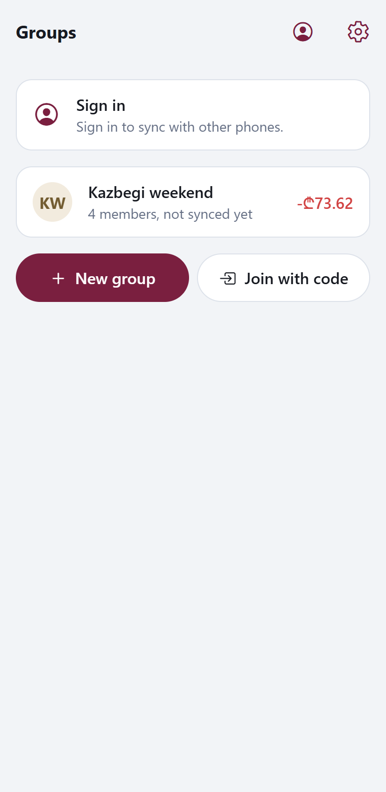
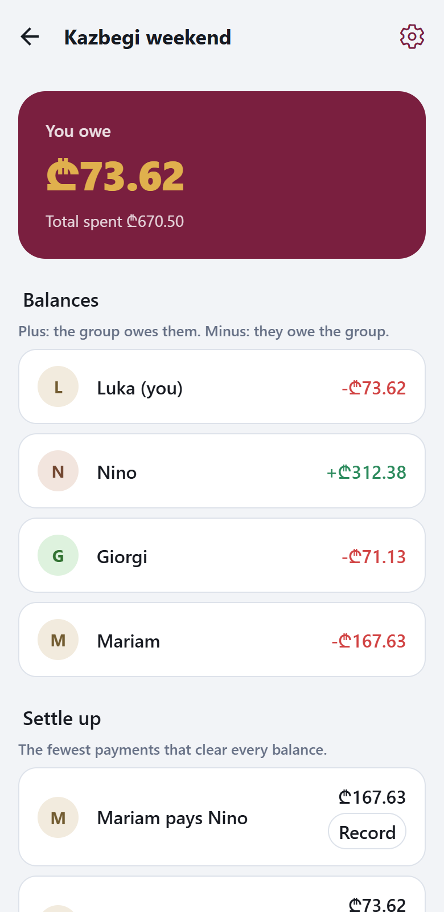
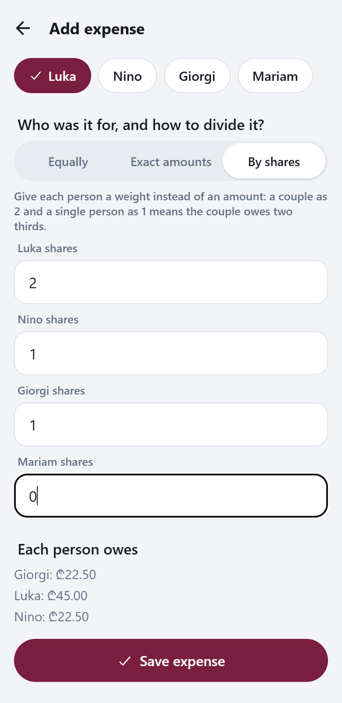
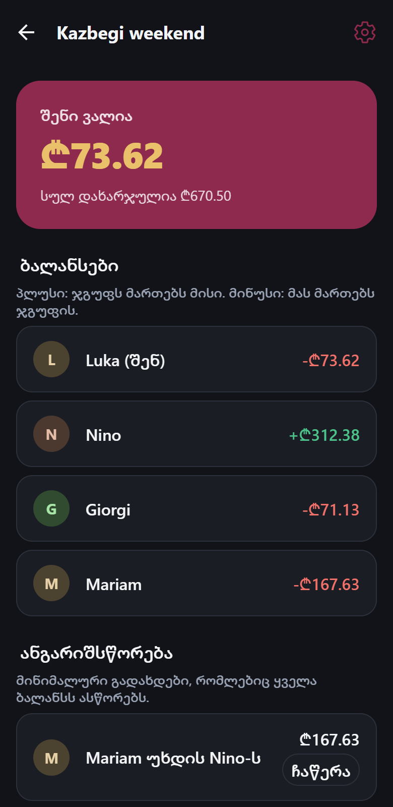
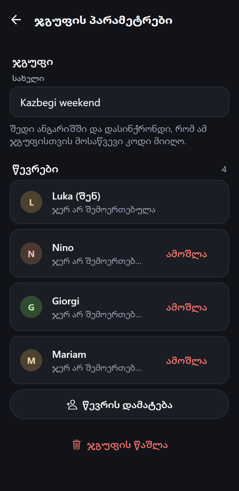
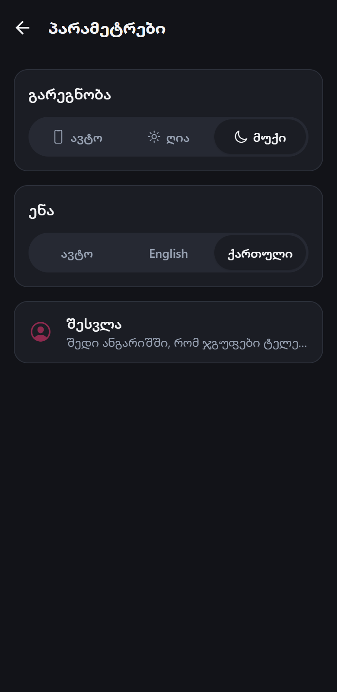

# Tsili

English · [ქართული](README.ka.md)

[](https://github.com/MrTabaOfficial/Tsili-Project/actions/workflows/ci.yml)

Tsili (წილი, "share" in Georgian) splits shared expenses for a trip or a shared flat. Everyone enters what they paid, the app works out who owes whom, and suggests the fewest payments that settle everything. It works fully offline and syncs between phones when there is a connection.

## Features

- **Groups** for a trip or a flat, with members added by name. Others join with an eight-character invite code, or tap an invite link that opens the app on the join screen with the code filled in.
- **Expenses** with who paid, the amount, a description and a date. Three ways to divide: equally, by exact amounts, or by shares (a couple as 2, a single person as 1).
- **Balances** per member, recomputed from the records every time, with a summary card that tells you at a glance whether you are owed money or owe it.
- **Settle up** with the fewest payments that clear every balance, and one tap to record a payment when it happens.
- **Repayments** ("Nino paid Luka 40 GEL") recorded alongside expenses; everything can be edited or deleted later.
- **Offline first.** Every screen works without a server. Sign in to sync between phones; changes made offline are pushed when you are back online.
- **English and Georgian**, light and dark, following the device by default. Amounts and dates are formatted per language.

## Screens

<p>
  
  
  
</p>
<p>
  
  
  
</p>

## How it works

### One source of truth for money

All amounts are whole numbers of tetri (1 GEL = 100 tetri). Decimal text exists only at the edges: user input is parsed with string arithmetic, so "0.29" becomes 29 rather than 28.999, and output is formatted per locale. The splitting, balance and settle-up logic lives in one shared package that both the phone and the server run. The server can therefore verify what phones send by recomputing it, and every phone arrives at the same numbers.

### Splitting and leftover tetri

When an amount does not divide evenly, someone has to carry the extra tetri. 100 tetri three ways is 34, 33, 33. The rule is largest remainder: each person gets the floor of their exact share, and the leftover tetri go one by one to the largest fractional parts. Ties are broken by member id, so the result does not depend on the order people were added or on which phone did the maths. Shares always sum to the amount exactly, and nobody is ever more than one tetri from their true share.

### Settle-up

Each member's net balance is computed first: positive means the group owes them, negative means they owe the group, and the balances always sum to zero. The plan is then greedy: any debtor who owes exactly what some creditor is owed gets paired with one payment, then the largest remaining debtor pays the largest remaining creditor until nothing is left. This never needs more payments than members with a non-zero balance minus one. Finding the absolute minimum is NP-hard, and for a group of friends the greedy plan is the right trade.

### Offline storage and sync

Every record carries a client-generated UUID, `createdAt`, `updatedAt` and `deletedAt`. Deleting marks the row rather than removing it, so other phones can learn that it is gone. On the phone, each changed row is flagged as dirty; that flag is the whole push queue.

Sync is one request per group: the phone sends its dirty rows and the cursor it got last time, the server validates each record with the shared schemas (recomputing splits and rejecting shares that do not match), applies them with a newer-`updatedAt`-wins rule, and returns everything that changed since the cursor. A record that loses a conflict is not an error; the phone receives the server copy and converges. Rejected records are reported and stay queued on the phone rather than vanishing. Syncs for one group run one at a time under a PostgreSQL advisory lock, so a slow writer cannot commit behind a cursor that has already moved past it.

### Members and accounts

A group can be set up offline with names only. When someone installs the app and joins with the invite code, they pick the name that is theirs and claim it, so expenses already recorded against that name are theirs from that moment. The server owns the link between a member and an account; phones cannot push it.

### Authentication

Access tokens are short-lived signed JWTs. Refresh tokens are random, stored only as hashes, and rotated on every use; presenting an already-used one revokes that whole session, while other devices stay signed in. Passwords are hashed with Node's built-in scrypt. Login answers identically for an unknown email and a wrong password and still runs the hash either way, so timing reveals nothing. Credential endpoints are rate limited per client address.

### Georgian with grammar

"Nino pays Luka" is "ნინო უხდის ლუკას": the name changes form. The translation layer inflects names for the dative and ergative cases, and writes Latin-script names the way Georgian does, "Luka-ს". A test checks that every string exists in both languages with the same placeholders.

## Tech stack

| Layer | Choices |
| --- | --- |
| Monorepo | npm workspaces: `shared/`, `server/`, `app/` |
| Shared | TypeScript, zod schemas (types are inferred from them) |
| Server | Node, Express 5, PostgreSQL in Docker Compose, Prisma 7, JWT via jose, pino logging |
| App | Expo SDK 57 (React Native), Expo Router, expo-sqlite, expo-secure-store, expo-localization |
| Tests | Vitest everywhere: pure logic in `shared`, HTTP tests against a real PostgreSQL in `server`, the app's data layer and sync engine against Node's built-in SQLite |
| UI checks | Headless Chrome against the Expo web build, used to click through flows and take the screenshots above |

### Repository layout

```
tsili/
├── shared/                  types, zod schemas and money logic used by both ends
│   └── src/
│       ├── money.ts         tetri type, error codes, deterministic id ordering
│       ├── split.ts         equal / exact / shares, largest-remainder leftovers
│       ├── balances.ts      net balance per member
│       ├── settle.ts        greedy settle-up plan
│       ├── domain.ts        Group, Member, Expense, Repayment schemas
│       └── api.ts           request/response schemas and the sync protocol
├── server/
│   ├── prisma/              PostgreSQL schema and migrations
│   ├── docker-compose.yml   PostgreSQL 17 with a separate test database
│   └── src/
│       ├── auth/            register, login, rotating refresh tokens
│       ├── groups/          groups, members, invite codes
│       ├── sync/            push/pull endpoint with the conflict rules
│       ├── invites/         the invite link page
│       ├── rateLimit.ts     per-address limiter for credential routes
│       └── app.ts           Express app factory; index.ts reads env and listens
├── app/
│   ├── app.json             Expo config; eas.json holds build profiles
│   └── src/
│       ├── app/             screens, one file per route (Expo Router)
│       ├── db/              SQLite schema, repositories, node:sqlite test adapter
│       ├── domain/          expense form logic, ledger hook
│       ├── sync/            sync engine and the provider that triggers it
│       ├── auth/            token storage and AuthProvider
│       ├── i18n/            en.ts, ka.ts and translate()
│       ├── settings/        theme and language preferences
│       ├── ui/              Button, ListRow, SegmentedControl, Chips, Avatar, ...
│       └── theme.ts         palette, radii, type scale
├── docs/screenshots/        images used in this README
└── .github/workflows/       CI
```

## How to run it

Prerequisites: Node 22 or newer, Docker, and Expo Go on a phone (or a simulator).

```sh
npm install                      # installs all workspaces and generates the Prisma client
```

Server:

```sh
cp server/.env.example server/.env   # set JWT_SECRET to any string of 32+ characters
npm run db:up -w server              # PostgreSQL in Docker
npm run db:deploy -w server          # apply migrations
npm run dev -w server                # http://localhost:4000
```

App:

```sh
cp app/.env.example app/.env         # set EXPO_PUBLIC_API_URL to your computer's LAN address, e.g. http://192.168.1.20:4000
npm run start -w app                 # scan the QR code with Expo Go
```

The phone must be on the same Wi-Fi as the computer, and Windows Firewall must allow inbound connections on port 4000. The app does everything locally without the server; signing in enables sync and invite codes.

### Development build

Expo Go is enough to try the app, but it is a generic shell. A development build is Tsili's own native shell with exactly its modules compiled in, which is also what a release is made from. With the Android SDK and a JDK installed and a device or emulator connected:

```sh
npm run android:dev -w app       # compiles the native project and installs it, then start Metro as usual
```

The generated `android/` folder is a build artefact and is not committed. Without a local SDK, the same build runs in Expo's cloud: `npx eas-cli build --profile development --platform android` from `app/`, using the profiles in `app/eas.json`.

Tests and checks:

```sh
npm test                      # shared, server (needs the Docker database), app
npm run typecheck
npm run bundle:check -w app   # Metro bundle for Android; catches import and config errors without a device
```

## Status

Everything above is implemented and tested, and CI runs it on every push. Next steps: a native date picker, and pagination of the sync pull for very large groups.

Known limits kept on purpose for now: conflicts are resolved by device clock, one currency per group, and the web build used for automated checks cannot survive a same-tab reload because expo-sqlite's web storage holds an exclusive lock.

## License

MIT. See [LICENSE](LICENSE).
